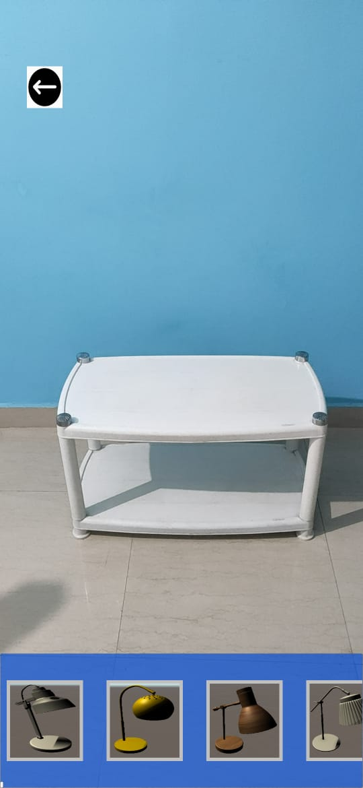
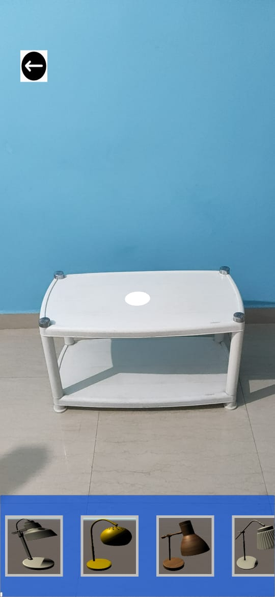
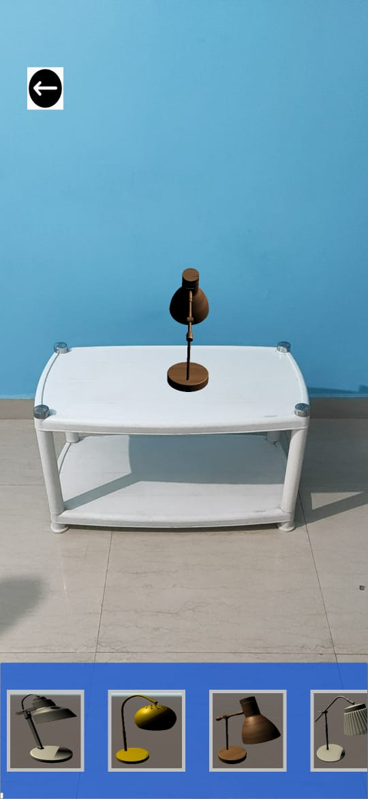
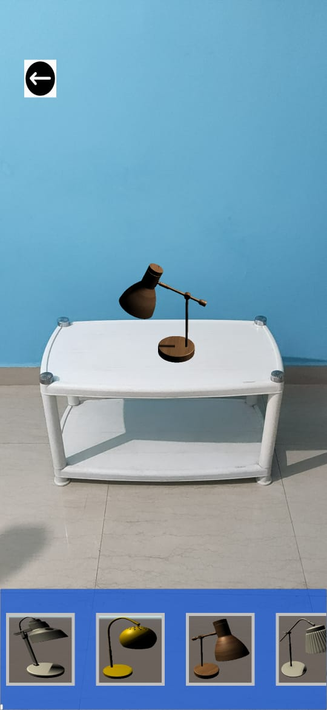
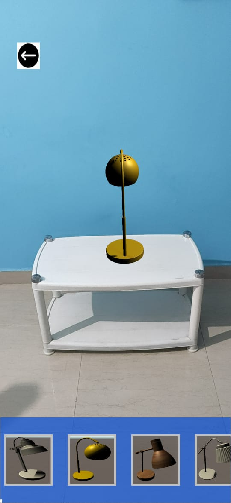
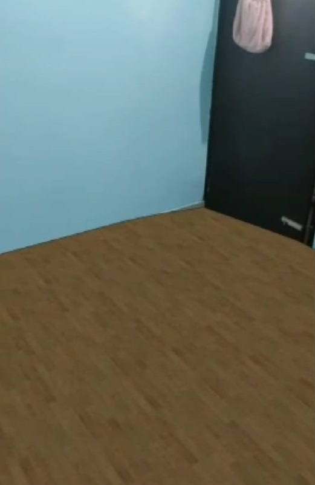

# Interiorismo
Interiorismo is an AR application to help you redecorate your house but with a lot of ease.
The app uses AR to project the 3d model of a furniture and the user can decide whether or not to use that furniture.

# Tech Stack
The languages and platforms that were used are:
1. Unity3d
2. AR Core
3. C#

The scripts are the essential part of the project and the models and prefabs can be added according to your choice.

<h4>At first the camera detects the environment<h4/>
 
 

 
 
<h4>Now the pointer gets instantiated on a horizontal plane<h4/>
 
 

 
 
<h4>After this the user can place furniture according to their choice and rotate it also<h4/>
 
 
  
 
 
<h4>We can also see which tile layout looks better in our surroundings<h4/>
 
 

 
 
